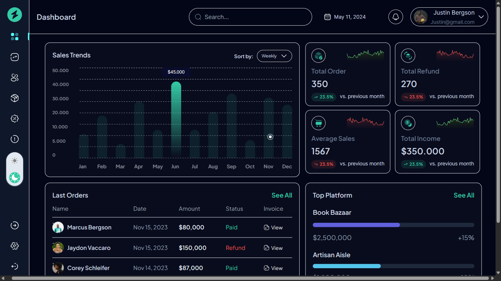

# Analytics Dashboard

## About

There's not much to say about this one. It is my entry for a hackathon where the challenge was to improve the UI as much as possible. I made it responsive across devices and added a dark mode theme. Also added a few features and some cool animations to increase the overall user experience!

## Technologies used

React, Tailwind, GSAP

### Screenshot

### Links

- Live Site URL: [https://feng-analytics-dashboard.netlify.app](https://feng-analytics-dashboard.netlify.app)

### Built with
 
- Vite
- Mobile-first workflow